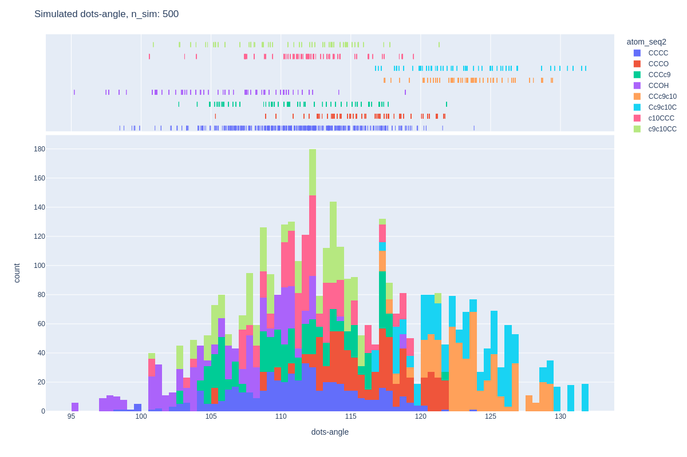
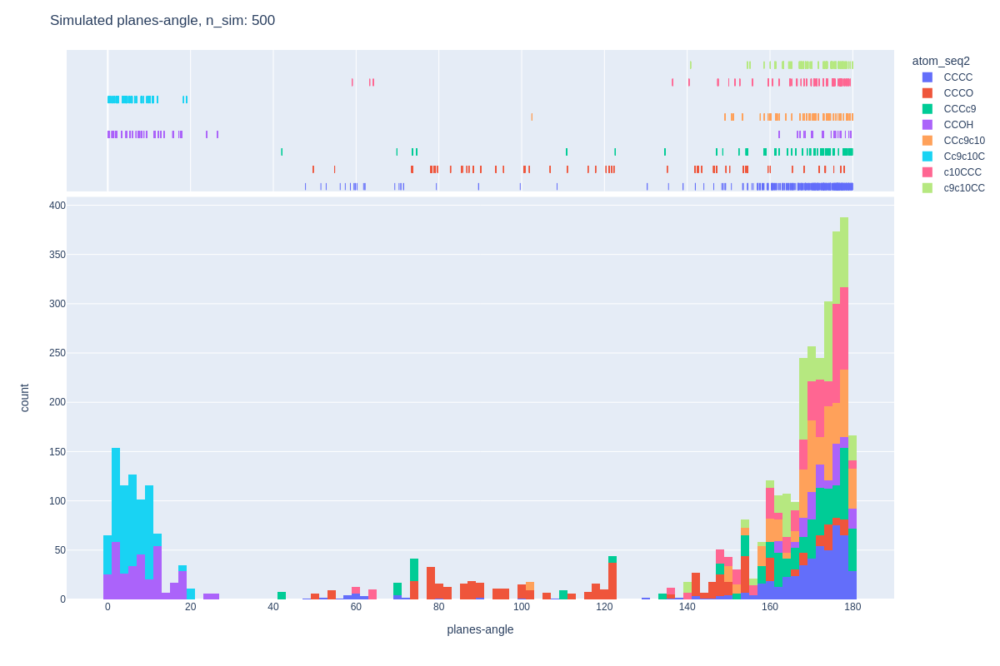
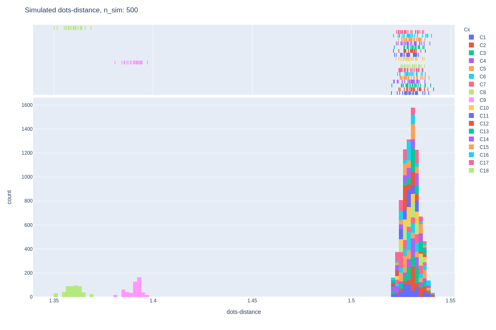

# protein-dynamics-ai

## Training Data

### Dots-Angle
* [https://storage.cloud.google.com/protein-dynamics-ai/dots-angle_histogram.html](https://storage.cloud.google.com/protein-dynamics-ai/dots-angle_histogram.html)

### Planes-Angle
* [https://storage.cloud.google.com/protein-dynamics-ai/planes-angle_histogram.html](https://storage.cloud.google.com/protein-dynamics-ai/planes-angle_histogram.html)

### Dots-Distance
* [https://storage.cloud.google.com/protein-dynamics-ai/dots-distance_histogram.html](https://storage.cloud.google.com/protein-dynamics-ai/dots-distance_histogram.html)

## Simulated Data

### Dots-Angle
* [https://storage.cloud.google.com/protein-dynamics-ai/dots-angle_sim.html](https://storage.cloud.google.com/protein-dynamics-ai/dots-angle_sim.html)

### Planes-Angle
* [https://storage.cloud.google.com/protein-dynamics-ai/planes-angle_sim.html](https://storage.cloud.google.com/protein-dynamics-ai/planes-angle_sim.html)

### Dots-Distance
* [https://storage.cloud.google.com/protein-dynamics-ai/dots-distance_sim.html](https://storage.cloud.google.com/protein-dynamics-ai/dots-distance_sim.html)

