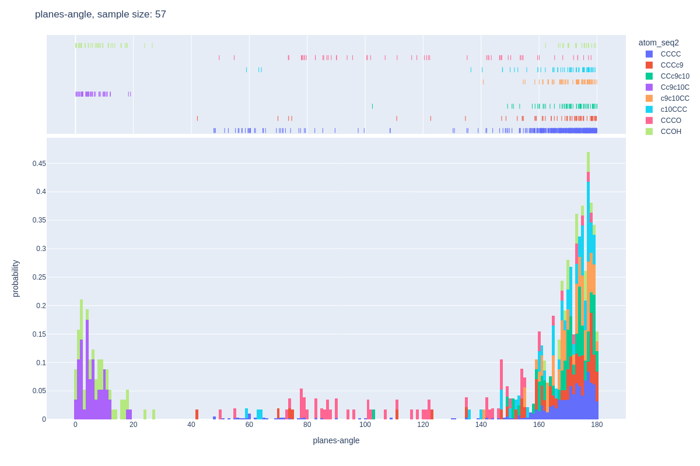
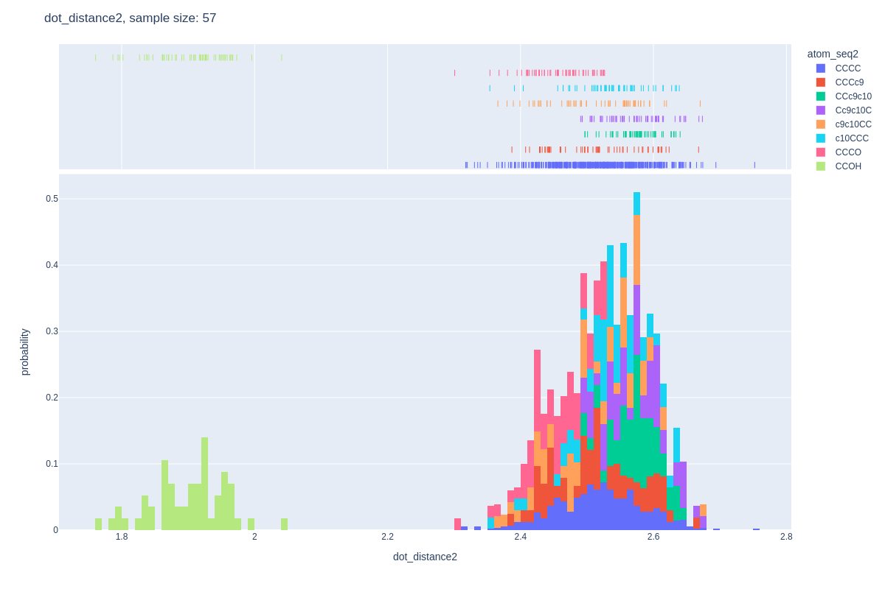

# protein-dynamics-ai  

## Install 
```
# Ubuntu 20
pip install plotly==4.14.3
pip install jupyterlab "ipywidgets>=7.5"
conda install -c plotly plotly-orca

sudo apt update
sudo apt install libgconf-2-4 libatk1.0-0 libatk-bridge2.0-0 libgdk-pixbuf2.0-0 libgtk-3-0 libgbm-dev libnss3-dev libxss-dev
sudo apt install xvfb
```

## Training Data
* [CeramideMix-lipids-Test.pdb](CeramideMix-lipids-Test.pdb)

### Dots-Angle
* [https://storage.cloud.google.com/protein-dynamics-ai/dots-angle_histogram.html](https://storage.cloud.google.com/protein-dynamics-ai/dots-angle_histogram.html)


### Planes-Angle
* [https://storage.cloud.google.com/protein-dynamics-ai/planes-angle_histogram.html](https://storage.cloud.google.com/protein-dynamics-ai/planes-angle_histogram.html)



### Dots-Distance
* [Dots-Distance-1](https://storage.cloud.google.com/protein-dynamics-ai/dot_distance1_histogram.html)


* [Dots-Distance-2](https://storage.cloud.google.com/protein-dynamics-ai/dot_distance2_histogram.html)


* [Dots-Distance-3](https://storage.cloud.google.com/protein-dynamics-ai/dot_distance3_histogram.html)


## Simulated Data
* [simulated pdb file](data_sim_all.pdb)
* 